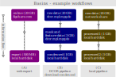

.. _sec_av_basins:

======
Basins
======

Motivation
==========
Basins are a powerful concept that allow you to save time, disk space,
and network usage when processing DC data. The basic idea behind basins is
that you avoid duplicating feature data by not copying all of the features
from an input file to an output file, but by *linking* from the output
file to the input file. Feature data "flows" from the basins to the
files downstream.

Due to the fact that basins are implemented in dclab, all software that relies
on dclab for opening data files (e.g. DCscope or CytoPlot) automatically
supports basins as well.

Use cases
=========
To illustrate how you can use basins in your analysis pipeline, let's consider
the three examples shown in :numref:`fig_basins_example_workflow`.

A. You have found a dataset on figshare.com that you would like to work with.
   However, you are only interested in a fraction of the events in that file.
   You decide to open the URL of that dataset with dclab, apply a few filters
   and export the resulting subset to a 500 MB file on disk with ``basins=True``
   (see :ref:`sec_av_basins_storing_basins` below for exporting with basins).
   The original file on figshare.com is now a basin of the file on
   your hard disk. If you e.g. decided not to export image data to your local
   file, you will still be able to access the images through the basin that
   is defined in the exported file as long as you have a working internet
   connection.

B. You have an automated data analysis pipeline that relies entirely on DCOR.
   You are uploading your raw data to DCOR. A background job performs
   segmentation and feature extraction and the resulting data are stored
   on DCOR as well. To have fast scalar feature access, you download the
   condensed dataset from DCOR to your computer. The raw image data as
   well as the background image data and the event masks are accessed via
   their respective basins when you open the condensed file with dclab.
   In this use case, you are trading local disk space for slower access to
   the image and mask features limited by the bandwidth of your internet
   connection.

C. Let's say your pipeline is designed to compute a new feature ``userdef1``
   and you would like to open the output file in DCscope, visualizing
   this feature in combination with other features defined in the input file
   (e.g. ``deform``). What you *could* do is write the ``userdef1`` feature
   directly to the input file or create a copy of your input file and write
   ``userdef1`` to that copy. However, this might make you feel uneasy,
   because you would like to avoid editing your original raw data (possible
   data loss) and copying an entire file seems like unnecessary overhead
   (redundant data, high disk usage). Furthermore, your raw data are located
   on a network share in your institute and you want to avoid causing a lot of
   traffic. The solution with basins is to open the raw input file, run your
   analysis and store the scalar features created by your analysis on your local
   computer. With basins, these local files know that the image data are
   stored on the network share. You have saved yourself the trouble of copying
   large files across the network.

.. _fig_basins_example_workflow:

    Three exemplary workflows where basins are used.
    **(A)** There is one basin consisting of an .rtdc file uploaded to figshare.
    The user exported partial feature data to their computer. Other feature
    data are still accessible via the online basin.
    **(B)** The user has a DCOR-based analysis pipeline where the raw and processed
    data are stored on DCOR. The user downloads a condensed version of the data
    and can access image data via basins.
    **(C)** The raw image data are located on a network share at the user's
    institute. The user writes one script to e.g. extract the relevant events
    (processed 1) and a second script to e.g. compute additional features
    (processed 2).

To summarize the advantages of using basins:

- **Avoid data redundancy**. Since basins defined in basins are also just basins,
  you can design your analysis pipeline as a chain of basins. The raw file
  contains the image data and subsequent steps in the pipeline only add features
  or gate events. You never have to store the same feature twice on disk.
- **Work with read-only datasets**. When you are computing new features, you
  do not have to modify any existing files on disk and can instead link to them.
  This means you can have your data on read-only file storage (e.g. online data)
  and don't have to fear accidental data loss.
- **Fast data access**. You do not have to download an entire dataset in order
  to obtain a simple scatter plot for offline usage. Instead, you can download
  only a few relevant scalar features, perform your analysis, and afterwards
  you even have the option to look at the images in the basin.

Definitions
===========
To clarify the notation, please read these definition of the terms used in
dclab in the context of basins. They also serve as a complete introduction
to the capabilities of basins.

referrer:
    A dataset that defines a basin "refers" to that basin. If a dataset
    is a referrer, then the dataset has features stored in other datasets
    (the basins).
basin:
    File or remote location containing feature data that are made accessible
    to the referrer. Both the referrer and the basin must originate from the same
    DC measurement. E.g. You can work with a local .rtdc file containing only
    :ref:´scalar features <sec_features_scalar>` with the image data stored
    in a basin on :ref:`DCOR <sec_av_dcor>` to keep your local disk usage low.
mapped basin:
    A mapped basin is a basin that does not share the same event indices
    with its referrer. This means that either

    - the basin is a superset of the referrer: This happens most often when you export
      a subset of events to a file, resulting in a referrer that has less events
      than the (mapped) basin file. This case is useful when you only need a subset
      of features in the referrer, but don't want to (spend the time to) store all
      feature data (e.g. image data) in the referrer to save disk space.
    - the basin is a subset of the referrer: This can happen when you analyze
      your data with `ChipStream <https://github.com/DC-Analysis/ChipStream>`_.
      For every image in the basin, the referrer defines one or more events,
      resulting in a referrer that has more events than the basin.
    - both cases above at the same time: There is really no limit in
      defining basins. You can have two referrer events map to one basin
      event or the other way around. The only limiting factor is that both,
      basin and referrer, must be derived from the same original measurement.

    Mapped basins allow you to minimize data redundancy for analysis pipelines
    that produce output files (referrers) with a subset of the events from the
    input file (basin).

    .. note::

        To be able to map from the input file to the output file, dclab stores the
        mapping information as integer indices in dedicated features enumerated
        ``basinmap0``, ``basinmap1``, etc.
internal basin:
    This is a special basin type, developed to reduce disk usage for background
    images (`image_bg`). An internal basin stores the basin data within the
    referrer file. While unintuitive for regular feature data, using internal
    basins to store background image data, with one background image per
    second, can significantly reduce disk usage due to the many-to-one-mapping
    nature of the problem.

In addition, let's digest the following definitions, which are also keyword arguments to the
:func:`RTDCWriter.store_basin <dclab.rtdc_dataset.writer.RTDCWriter.store_basin>`
method used further below.

basin type:
    A basin can be a local *file* (including files on a network share),
    an *internal* basin (see above), or a *remote* file which means that it is
    accessible via a networking protocol. Local basins can be defined either
    via absolute and/or relative paths. Remote basins can be simple links
    (e.g. download links for a figshare resource), DCOR resource identifiers,
    or links to an object in an S3-compatible object store (e.g. Amazon S3 or
    OpenStack Swift).
basin format:
    This is the subclass of :class:`.RTDCBase` that
    defines how the basin is accessed. For *file*-type basins, this is "hdf5"
    and for *remote*-type basins, this is "dcor", "http", or "s3".
basin mapping:
  If the events enumerated in the referrer are identical to the events in
  the basin, then we call the mapping "same". Otherwise, we call it a
  **mapped basin** followin the definition above.
basin features:
    Feature information in a dataset as defined in the
    :ref:`general feature section <sec_features>`. Basins are only ever defined
    for features. There is no such thing as basins for metadata, tables, or logs.
    You may define basins and explicitly state the features this basin provides.
    In combination with mapping, you could e.g. realize your own event
    segmentation pipeline, storing only the ``mask`` feature and extracted
    scalar features in you output file, while you define the ``image`` feature
    via the input file basin. If you combine this approach with the
    `dcor <https://dc.readthedocs.io>`_ basin format, you can distribute all of
    your data (raw and processed) in a very efficient and transparent manner.

.. note::

   Note that basins are locations *upstream* in your analysis pipeline.
   Features *flow* from basins downstream to the referrers. When a dataset
   has basins, this means that there are other files (the basins) that
   contain additional feature data.

.. note::

   Basins can have basins. A referrer can refer to multiple basins. And
   a referrer can be a basin as well. Basins of basins are passed down
   to referrers downstream.

These definitions should already give you a good feeling about how you can
employ basins in your workflow. As a final note, be aware that you can also
define basins recursively. Basins can have basins. And dclab has a check for
circular basin definitions so you don't have to worry about that as well.

Defining Basins
===============
Basins may have different properties depending on the use case. Let's
dive into an example:

.. code-block:: python

   import dclab

   with (dclab.new_dataset("input.rtdc") as ds,
         dclab.RTDCWriter("output.rtdc") as hw):
       # `ds` is the basin
       # `hw` is the referrer

       # First of all, we have to copy the metadata from the input file
       # to the output file. If we forget to do this, then dclab will
       # not be able to open the output file.
       hw.store_metadata(ds.config.as_dict(pop_filtering=True))

       # Next, we can compute and write the new feature to the output file.
       hw.store_feature("userdef1", np.random.random(len(ds)))

       # Finally, we write the basin information to the output file.
       hw.store_basin(
           basin_name="raw data",
           basin_type="file",
           basin_format="hdf5",
           basin_locs=["input.rtdc"],
       )

   # You can now open the output file and verify that everything worked.
   with dclab.new_dataset("output.rtdc") as ds_out:
       assert "userdef1" in ds_out, "check that the feature we wrote is there"
       assert "image" in ds_out, "check that we can access basin features"
       # You could also be more specific:
       assert "userdef1" in ds_out.features_innate
       assert "image" in ds_out.features_basin

What happened? First, we created an ``output.rtdc`` file that contains the metadata
from the ``ìnput.rtdc`` file. This is important so that dclab can verify the basin
when we open the referrer. Then, we wrote the feature ``userdef1``, filled with
random data, to the referrer. Finally we stored the basin information referencing
**all** features from the ``input.rtdc`` file.
To make sure everything worked, we opened the output referrer file and saw that dclanb
transparently gives us access to the features stored in the referrer and the basin.

Examples
========

Mapped basin via RTDCWriter
---------------------------
You can explicitly define a mapped basin via the :func:`RTDCWriter.store_basin
<dclab.rtdc_dataset.writer.RTDCWriter.store_basin>`
method (see also the example after this one).

.. code-block:: python

   import dclab
   import numpy as np

   with (dclab.new_dataset("input.rtdc") as ds,
         dclab.RTDCWriter("output.rtdc") as hw):

       # metadata
       hw.store_metadata(ds.config.as_dict(pop_filtering=True))

       # take every second event from the input file
       event_mapping = np.arange(len(ds), None, 2, dtype=np.uint64)

       # write the basin
       hw.store_basin(
           basin_name="raw data",
           basin_type="file",
           basin_format="hdf5",
           basin_locs=["input.rtdc"],
           basin_map=event_mapping,
       )

   # verify that this worked
   with (dclab.new_dataset("input.rtdc") as ds_in,
         dclab.new_dataset("output.rtdc") as ds_out):
       assert np.allclose(ds_in["deform"][::2], ds_out["deform"])

Implicitly mapped basin via HDF5 export
---------------------------------------
It is also possible to implicitly write basin information to an exported file,
achieving the same result as above (a very small output file).

.. code-block:: python

   import dclab
   import numpy as np

   with dclab.new_dataset("input.rtdc") as ds:
       # remove every second event
       ds.filter.manual[1::2] = False
       ds.apply_filter()
       # export the dataset with the mapped basin
       ds.export.hdf5(path="output.rtdc",
                      features=[],
                      filtered=True,
                      basins=True)

   # verify that this worked
   with (dclab.new_dataset("input.rtdc") as ds_in,
         dclab.new_dataset("output.rtdc") as ds_out):
       assert np.allclose(ds_in["deform"][::2], ds_out["deform"])

Rewriting Basins
================
In some situations, you might have to modify the location of a basin, e.g.
because you need to make the basins available on different operating systems
or because the network share location changed. In those cases, the best
approach is to read the basin information, update the basin location and
write the updated basin information to that file.

First, locate the basin you would like to modify by listing all basin
locations.

.. code-block:: python

   with dclab.new_dataset("data_file.rtdc") as ds:
       for ii, bn_dict in enumerate(ds.basins_get_dicts()):
           print(ii, bn_dict["type"], bn_dict.get("paths"), bn_dict["features"])

This will return something like this:

.. code-block::

    0 file ['/ptmp/data/RC/Reference/2025-02-09_09.46_M003_Reference_5000.rtdc'] ['image']
    1 internal ['basin_events'] ["image_bg"]

.. note::

   The second basin in this example ("basin_events" location) is an internal
   basin (see definitions above).

As you can see, the basin containing the image data is located on a posix
path ``/ptmp`` which is not accessible on Windows. Assuming you had the
same network location mounted on drive ``P:\\``, you could add an additional
basin to the file like so:

.. code-block:: python

   import json

   from dclab.util import hashobj

   with dclab.new_dataset("data_file.rtdc") as ds:
       # we want to edit the first file-based basin dictionary containing the image data
       bn_dict = ds.basins_get_dicts()[0]

   # replace the path to the basin with the new path
   bn_dict["paths"] = [r"P:\\data\RC\Reference\2025-02-09_09.46_M003_Reference_5000.rtdc"]
   # remove the "key" from the dictionary (it is part of the old basin)
   bn_dict.pop("key")
   # convert the basin information to a JSON string
   b_lines = json.dumps(bn_dict, indent=2, sort_keys=True).split("\n")
   # compute the new basin key
   key = hashobj(b_lines)

   # write the new basin
   with dclab.RTDCWriter("data_file.rtdc") as hw:
       if key not in hw.h5file["basins"]:
           hw.write_text(hw.h5file["basins"], key, b_lines)

After that, you can open the dataset on Windows and access the information
in the basin via the mounted network share on drive ``P:\\``.

Accessing private basin data
============================

DCOR
----
If you have basins defined that point to private data on DCOR, you have to
register your DCOR access token in dclab via the static method
:func:`dclab.rtdc_dataset.fmt_dcor.api.APIHandler.add_api_key`.

S3
--
For basins that point to files on S3, you have to specify the environment
variables ``DCLAB_S3_ACCESS_KEY_ID`` and ``DCLAB_S3_SECRET_ACCESS_KEY``, and
optionally the ``DCLAB_S3_ENDPOINT_URL`` as described in the
:ref:`S3 access section <sec_av_s3_private>`.

Basin internals
===============

.. _sec_av_basins_storing_basins:

Storing the basin information
-----------------------------
In the ``output.rtdc`` file, the basin is stored as a json-encoded string in an
HDF5 dataset in the ``"/basins"`` group. For the HDF5 export example above,
the json data looks like this:

.. code-block:: json

   {
     "description": "Exported with dclab 0.58.0",
     "format": "hdf5",
     "name": "Exported data",
     "type": "file",
     "features": null,
     "mapping": "basinmap0",
     "identifier": "1231ae-31f23-342-232-42b1c",
     "paths": [
       "/absolute/path/to/input.rtdc",
       "input.rtdc"
     ]
   }

The description and name are filled automatically by dclab here. As expected,
the type of the basin is *file* and the format of the basin is *hdf5*. There
are a few things to notice:

- The features are set to ``null`` which means ``None``, i.e. **all** features
  from the input file are allowed.
- The *mapping* key reads *basinmap0*. This is the name of the feature
  in which to find the mapping information from the input file to the
  output file. The information can be found in the HDF5 dataset
  ``/events/basinmap0`` in the output file. Note that the fact that this mapping
  information is stored *as a feature* means that it is also properly
  gated when you define basins iteratively.
- The *identifier* is a string that matches the identifier of the dataset.
  When creating basins without a "same" mapping (as in this case), then the
  referrer will obtain an identifier that starts with this identifier, but
  contains additional text. This means identifiers are effectively cryptic
  data analysis trackers.
- There are two *paths* defined, an absolute path (from the root of the file
  system) and a relative path (relative to the directory of the output file).
  This relative path makes it possible to copy-paste these two files *together* to
  other locations. You will always be able to open the output file and see the
  basin features defined in the input file. Internally, dclab also checks
  the :meth:`run identifier <dclab.rtdc_dataset.RTDCBase.get_measurement_identifier>`
  of the output file against that of the input file to avoid loading basin
  features from the wrong file.

For the sake of completeness, let's see how the basin information looks
like when you derive the output file from a DCOR resource:

.. code-block:: python

   import dclab
   import numpy as np

   with dclab.new_dataset("fb719fb2-bd9f-817a-7d70-f4002af916f0") as ds:
       ds.filter.manual[1::2] = False
       ds.apply_filter()
       ds.export.hdf5(path="output.rtdc",
                      features=[],
                      filtered=True,
                      basins=True)

The corresponding json data:

.. code-block:: json

   {
     "description": "Exported with dclab 0.58.0",
     "format": "dcor",
     "name": "Exported data",
     "type": "remote",
     "features": null,
     "mapping": "basinmap0",
     "urls": [
       "https://dcor.mpl.mpg.de/api/3/action/dcserv?id=fb719fb2-bd9f-817a-7d70-f4002af916f0"
     ]
   }

As you can see, *paths* is replaced by *urls* and the *format* and *type*
keys changed. The rest remains the same. This also works with private DCOR
resources, given that you have globally set your API token as described in
the :ref:`DCOR section <sec_av_dcor_private_access>`.

Basin loading procedure
-----------------------
When dclab opens a dataset the defines a basin, the basin features are
retrieved only when they are needed (i.e. when the user tries to access
them and they are not defined as innate features). Internally, dclab
instantiates an :class:`.RTDCBase` subclass as defined by the *format*
key. For mapped basins, dclab additionally creates a hierarchy child from the
original dataset by filling the manual filtering array with the mapping information.
To see which features are defined in basins, you can check the
:func:`RTDCBase.features_basin <dclab.rtdc_dataset.RTDCBase.features_basin>`
property. The basins are directly accessible via :func:`RTDCBase.basins
<dclab.rtdc_dataset.RTDCBase.basins>` (and the basin datasets via
``RTDCBase.basins[index].ds``).
