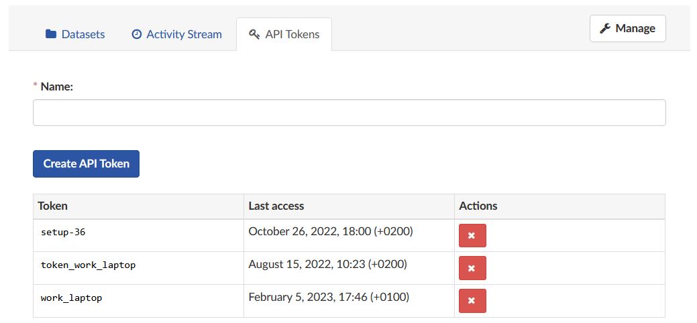

.. _sec_av_dcor:

===================
Accessing DCOR data
===================

The `deformability cytometry open repository (DCOR)
<https://dcor.mpl.mpg.de>`_ allows you to upload and access RT-DC
datasets online (internet connection required). The advantage is that
you can access parts of the dataset (e.g. just two features) without
downloading the entire data file (which includes image, contour, and
traces information).

Public data
===========

When you would previously download an entire dataset and do

.. code:: python

    import dclab
    ds = dclab.new_dataset("/path/to/Downloads/calibration_beads.rtdc")

you can now skip the download and use the identifier (id) of a DCOR resource
like so:

.. code:: python

    import dclab
    ds = dclab.new_dataset("fb719fb2-bd9f-817a-7d70-f4002af916f0")

To determine the DCOR resource id, go to https://dcor.mpl.mpg.de,
find the resource you are interested in, scroll down to the bottom,
and copy the value from the **id** (not *package id* or *revision id*)
field in (*Additional Information*). The DCOR format is documented in
:ref:`sec_ref_rtdc_dataset_dcor`.

Private data
============

If you want to access private data, you need to pass a personal
API Token:

.. code:: python

    import dclab
    ds = dclab.new_dataset("fb719fb2-bd9f-817a-7d70-f4002af916f0",
                           api_key="XXXX-YYYY-ZZZZ")

You can manage your API Tokens on your profile page when
logged in at https://dcor.mpl.mpg.de.

Alternatively, you can also set an API Token globally using

.. code:: python

    import dclab
    from dclab.rtdc_dataset.fmt_dcor import APIHandler
    APIHandler.add_api_key("XXXX-YYYY-ZZZZ")
    ds = dclab.new_dataset("fb719fb2-bd9f-817a-7d70-f4002af916f0")

Managing API Tokens
===================

You can manage your API Tokens on your profile page when
logged in at https://dcor.mpl.mpg.de.

    Managing API Tokens on DCOR.

- Deleting a token:

  Click on the tab "API Tokens" to view all currently existing tokens and
  the date they were last accessed. By clicking on the red "X" you can delete
  a token. It cannot be restored, so be careful when deleting tokens!

- Creating a new token:

  To create a new token, insert a name in the field at the top and click
  "Create API Token". The newly generated token will be shown at the top of the
  page. Make sure you copy it directly, because you will not be able to recall
  it again!

Accessing data on a different DCOR instance
===========================================

To access data on a different DCOR instance, you have to pass the respective
URL when opening the dataset via the keyword ``host``. The procedure to
retrieve the DCOR resource id is the same as for the default DCOR.

.. code:: python

    import dclab
    ds = dclab.new_dataset("fb719fb2-bd9f-817a-7d70-f4002af916f0",
                           host="dcor-dev.mpl.mpg.de")
