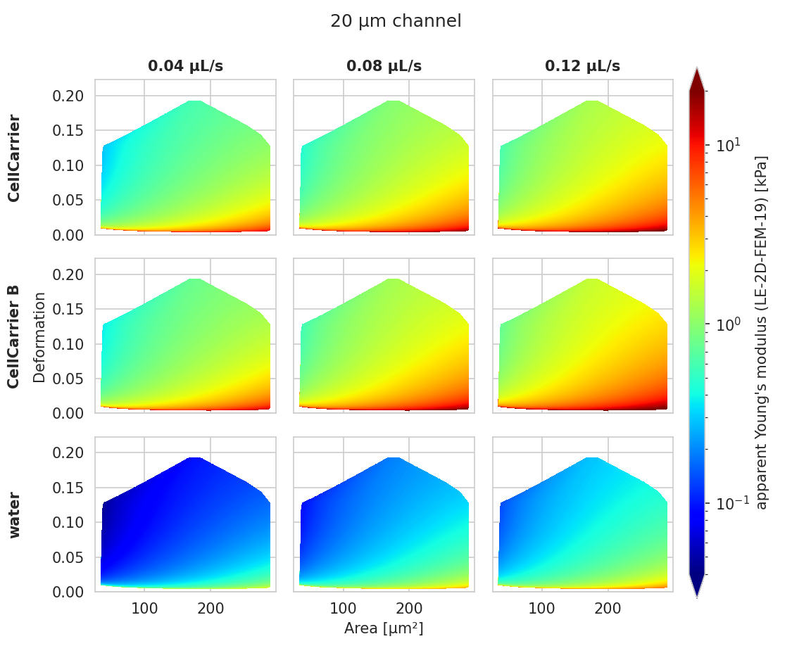

.. _sec_av_emodulus:

===========================
Young's modulus computation
===========================

Background
==========
The computation of the Young's modulus makes use of look-up tables (LUTs)
which are discussed in detail further below. All LUTs are treated identically
with respect to the following correction terms:

- **scaling laws:** The original LUT was computed for a specific
  channel width :math:`L`, flow rate :math:`Q`, and viscosity :math:`\eta`.
  If the experimental values of these parameters differ from those in
  the simulation, then they must be scaled before interpolating the
  Young's modulus. The scale conversion rules can be derived from the
  characteristic length :math:`L` and stress :math:`\sigma=\eta \cdot Q/L^3`
  :cite:`Mietke2015`. For instance, the event area scales with
  :math:`(L_\text{exp}/L_\text{LUT})^2`, the Young's modulus scales with
  :math:`\sigma_\text{exp}/\sigma_\text{LUT}`, and the deformation is not scaled
  as it has no units. Please note that the scaling laws were derived for
  linear elastic materials and may not be accurate for other materials
  (e.g. hyperelastic). The scaling laws are implemented in the submodule
  :mod:`dclab.features.emodulus.scale_linear`.

- **pixelation effects**: All features (including deformation and area) are
  computed from a pixelated contour. This has the effect that deformation
  is overestimated and area is underestimated (compared to features computed
  from a "smooth" contour). While a slight change in area does not have a
  significant effect on the interpolated Young's modulus, a systematic error
  in deformation may lead to a strong underestimation of the Young's modulus.
  A deeper analysis is visualized in the plot
  `pixelation_correction.png <https://github.com/ZELLMECHANIK-DRESDEN/dclab/blob/master/scripts/pixelation_correction.png>`_
  which was created with
  `pixelation_correction.py <https://github.com/ZELLMECHANIK-DRESDEN/dclab/blob/master/scripts/pixelation_correction.py>`_.
  Thus, before interpolation, the measured deformation must be corrected
  using a hard-coded correction function :cite:`Herold2017`.
  The pixelation correction is implemented in the submodule
  :mod:`dclab.features.emodulus.pxcorr`.

- **shear-thinning and temperature-dependence**: The viscosity of a medium
  usually is a function of temperature. In addition, complex media, such as
  0.6\% methyl cellulose (CellCarrier B), may also exhibit
  `shear-thinning <https://en.wikipedia.org/wiki/Shear_thinning>`_.
  The viscosity of such media decreases with increasing flow rates. Since the
  viscosity is required to apply the scaling laws (above), it must be
  corrected which is done using hard-coded correction functions
  :cite:`Herold2017`. The computation of viscosity is implemented in the
  submodule :mod:`dclab.features.emodulus.viscosity`.

LUT selection
=============
When computing the Young's modulus, the user has to select a LUT via a
keyword argument (see next section). The LUT initially implemented in dclab
has the identifier "LE-2D-FEM-19".

LE-2D-FEM-19
------------
This LUT was derived from simulations based on the finite elements method (FEM)
:cite:`Mokbel2017` and the analytical solution :cite:`Mietke2015`.
The LUT was generated with an incompressible (Poisson's ratio of 0.5)
linear elastic sphere model (an artificial viscosity was added to
avoid division-by-zero errors) in an axis-symmetric channel (2D).
Although the simulations were carried out in this cylindrical symmetry,
they can be mapped onto a square cross-sectional channel by adjusting
the channel radius to approximately match the desired flow profile.
This was done with the spatial scaling factor 1.094
(see also supplement S3 in :cite:`Mietke2015`). The original data
used to generate the LUT are available on figshare :cite:`FigshareWittwer2020`.

    Visualizations of the support and the values of the look-up table (LUT)
    'LE-2D-FEM-19' used for determining the Young's modulus from deformation and
    cell area. The values of the Young's moduli in the regions
    shown depend on the channel size, the flow rate, the temperature,
    and the viscosity of the medium :cite:`Mietke2015`.
    Here, they are computed for a 20 µm wide channel at 23°C with an
    effective pixel size of 0.34 µm. The data are corrected for pixelation
    effects according to :cite:`Herold2017`.

external LUT
------------
If you are generating LUTs yourself, you may register them in dclab using
the function :func:`dclab.features.emodulus.load.register_lut`:

.. code:: python

    import dclab
    dclab.features.emodulus.register_lut("/path/to/lut.txt")

Please make sure that you adhere to the file format. An example can be found
`here <https://github.com/ZELLMECHANIK-DRESDEN/dclab/blob/master/dclab/features/emodulus/emodulus_lut_LE-2D-FEM-19.txt>`_.

Usage
=====
Since the Young's modulus is model-dependent, it is not made available
right away as an :ref:`ancillary feature <sec_features_ancillary>`
(in contrast to e.g. event volume or average event brightness).

.. ipython::

    In [1]: import dclab

    In [2]: ds = dclab.new_dataset("data/example.rtdc")

    # "False", because we have not set any additional information.
    In [3]: "emodulus" in ds

Additional information is required. There are three scenarios:

A) The viscosity/Young's modulus is computed individually from the chip
   temperature for **each** event. Required information:

  - The `temp` feature which holds the chip temperature of each event
  - The configuration key [calculation]: 'emodulus lut'
  - The configuration key [calculation]: 'emodulus medium'

B) Set a global viscosity. Use this if you have measured the viscosity
   of your medium (and know all there is to know about shear thinning
   :cite:`Herold2017`). Required information:

  - The configuration key [calculation]: 'emodulus lut'
  - The configuration key [calculation]: 'emodulus viscosity'

C) Compute the Young's modulus using the viscosities of known media.

  - The configuration key [calculation]: 'emodulus lut'
  - The configuration key [calculation]: 'emodulus medium'
  - The configuration key [calculation]: 'emodulus temperature'

  Note that if 'emodulus temperature' is given, then this temperature
  is used, even if the `temp` feature exists (scenario A).

The key 'emodulus lut' is the LUT identifier (see previous section).
The key 'emodulus medium' must be one of the supported media defined in
:data:`dclab.features.emodulus.viscosity.KNOWN_MEDIA` and can be
taken from [setup]: 'medium'.
The key 'emodulus temperature' is the mean chip temperature and
could possibly be available in [setup]: 'temperature'.

.. plot::

    import matplotlib.pylab as plt

    import dclab

    ds = dclab.new_dataset("data/example.rtdc")

    # Add additional information. We cannot go for (A), because this example
    # does not have the temperature feature (`"temp" not in ds`). We go for
    # (C), because the beads were measured in a known medium.
    ds.config["calculation"]["emodulus lut"] = "LE-2D-FEM-19"
    ds.config["calculation"]["emodulus medium"] = ds.config["setup"]["medium"]
    ds.config["calculation"]["emodulus temperature"] = 23.0  # a guess

    # Plot a few features
    ax1 = plt.subplot(121)
    ax1.plot(ds["deform"], ds["emodulus"], ".", color="k", markersize=1, alpha=.3)
    ax1.set_ylim(0.1, 5)
    ax1.set_xlim(0.005, 0.145)
    ax1.set_xlabel(dclab.dfn.get_feature_label("deform"))
    ax1.set_ylabel(dclab.dfn.get_feature_label("emodulus"))

    ax2 = plt.subplot(122)
    ax2.plot(ds["area_um"], ds["emodulus"], ".", color="k", markersize=1, alpha=.3)
    ax2.set_ylim(0.1, 5)
    ax2.set_xlim(30, 120)
    ax2.set_xlabel(dclab.dfn.get_feature_label("area_um"))

    plt.show()
