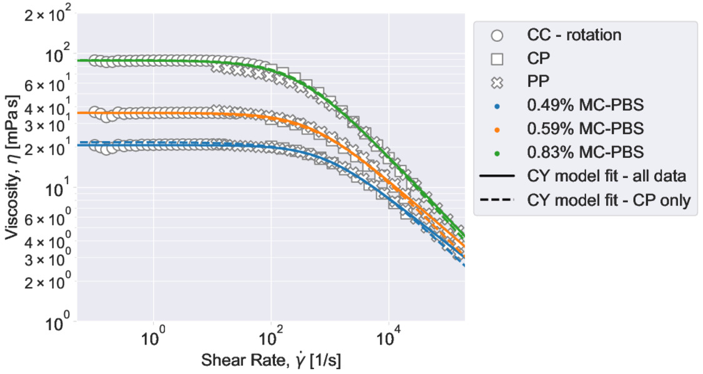
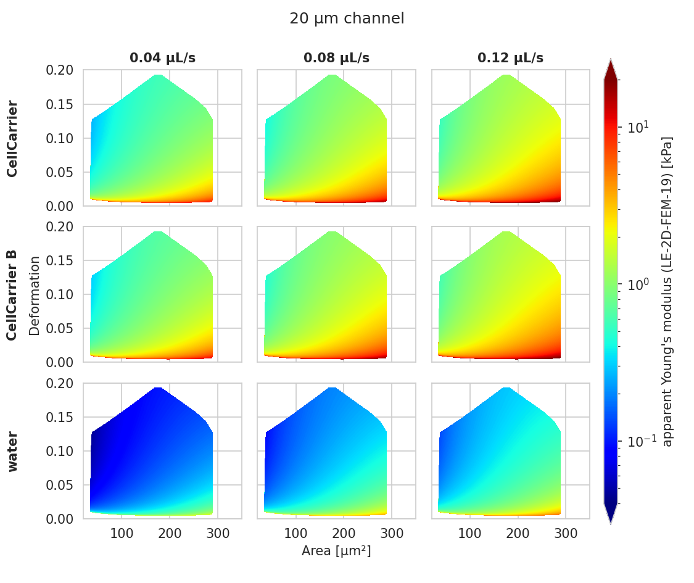
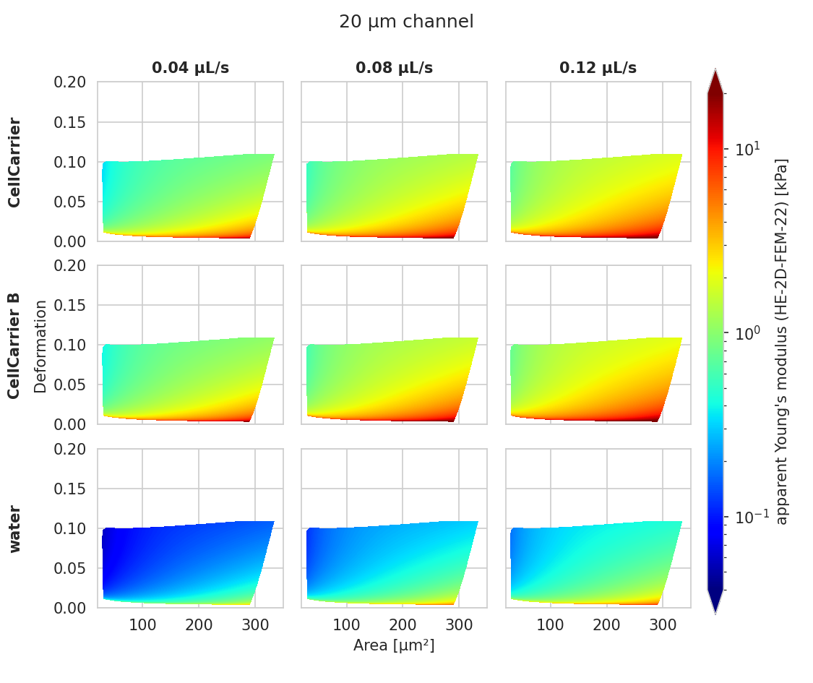
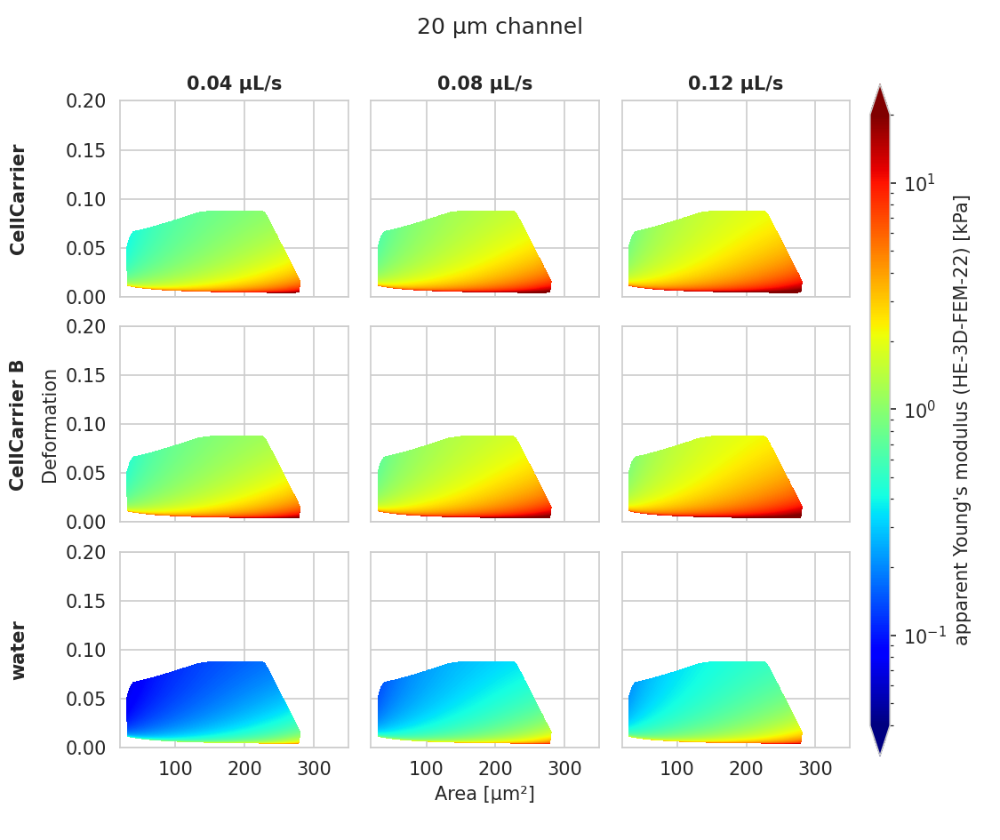

.. _sec_av_emodulus:

===========================
Young's modulus computation
===========================

Background
==========
The computation of the Young's modulus makes use of look-up tables (LUTs)
which are discussed in detail further below. All LUTs are treated identically
with respect to the following correction terms:

- **scaling laws:** The original LUT was computed for a specific
  channel width :math:`L`, flow rate :math:`Q`, and viscosity :math:`\eta`.
  If the experimental values of these parameters differ from those in
  the simulation, then they must be scaled before interpolating the
  Young's modulus. The scale conversion rules can be derived from the
  characteristic length :math:`L` and stress :math:`\sigma=\eta \cdot Q/L^3`
  :cite:`Mietke2015`. For instance, the event area scales with
  :math:`(L_\text{exp}/L_\text{LUT})^2`, the Young's modulus scales with
  :math:`\sigma_\text{exp}/\sigma_\text{LUT}`, and the deformation is not scaled
  as it has no units. Please note that the scaling laws were derived for
  linear elastic materials and may not be accurate for other materials
  (e.g. hyperelastic). The scaling laws are implemented in the submodule
  :mod:`dclab.features.emodulus.scale_linear`.

- **pixelation effects**: All features (including deformation and area) are
  computed from a pixelated contour. This has the effect that deformation
  is overestimated and area is underestimated (compared to features computed
  from a "smooth" contour). While a slight change in area does not have a
  significant effect on the interpolated Young's modulus, a systematic error
  in deformation may lead to a strong underestimation of the Young's modulus.
  A deeper analysis is visualized in the plot
  `pixelation_correction.png <https://github.com/DC-analysis/dclab/blob/master/scripts/pixelation_correction.png>`_
  which was created with
  `pixelation_correction.py <https://github.com/DC-analysis/dclab/blob/master/scripts/pixelation_correction.py>`_.
  Thus, before interpolation, the measured deformation must be corrected
  using a hard-coded correction function :cite:`Herold2017`.
  The pixelation correction is implemented in the submodule
  :mod:`dclab.features.emodulus.pxcorr`.

- **shear-thinning and temperature-dependence**: The viscosity of a medium
  usually is a function of temperature. In addition, complex media, such as
  0.59\% methyl cellulose (CellCarrier B) which is used in standard blood
  measurements, may also exhibit
  `shear-thinning <https://en.wikipedia.org/wiki/Shear_thinning>`_.
  The viscosity of such media decreases with increasing flow rates. Since the
  viscosity is required to apply the scaling laws (above), it must be
  corrected which is done using hard-coded correction functions as
  described in the next section.

.. _sec_emodulus_viscosity:

Viscosity
=========
The computation of the viscosity is implemented in the :mod:`corresponding submodule
<dclab.features.emodulus.viscosity>`. For regular RT-DC measurements, the medium
used is methyl cellulose (MC) dissolved in phosphate-buffered saline (PBS).
For the most common MC concentrations, dclab comes with hard-coded models that
compute the corresponding medium viscosity. These models are the original
`herold-2017` :cite:`Herold2017` model and the more recent
`buyukurganci-2022` :cite:`Buyukurganci2022,Reichel2023` model.

The MC-PBS solutions show a shear thinning behavior, which can be described
by the viscosity :math:`\eta` following a power law at sufficienty high
shear rates :math:`\dot{\gamma}`:

.. math::

    \eta = K \cdot \left( \frac{ \dot{\gamma} }{ \dot{\gamma}_0} \right)^{n-1},

where :math:`\dot\gamma` is the shear rate, :math:`K` is the flow consistency
index and :math:`n` is the flow behavior index.
The shear rate inside a square microchannel cannot be described as a
single number for a shear thinning liquid. The shear rate is
best described by the shear rate at the channel walls as proposed by
Herold :cite:`Herold2017` and can be calculated as follows:

.. math::

    \dot\gamma = \frac{8 Q}{L^3}\left( 0.6671 + \frac{0.2121}{n}\right).

These considerations are the foundation for the viscosity calculations in the
`herold-2017` :cite:`Herold2017` and
`buyukurganci-2022` :cite:`Buyukurganci2022` models.

.. note::

    As discussed in :cite:`Reichel2023`, the `herold-2017` model
    inaccurately models the temperature dependency of the MC-PBS viscosity.
    The temperature dependency was measured using a falling ball
    viscometer where the change in shear rate could not be controlled.
    For the `buyukurganci-2022` model, the temperature dependency was
    measured as a function of shear rate. Take a look at the
    :ref:`example script that compares these models <example_viscosity_models>`
    to gain more insight.

.. warning::

    Never compare the Young's moduli computed from different viscosity
    models. Up until dclab 0.47.8, all values of the Young's modulus
    were computed using the old `herold-2017` model. For new data
    analysis pipelines, you should use the more accurate
    `buyukurganci-2022` model.

Büyükurgancı 2022
-----------------

Büyükurgancı et al. characterized the viscosity curves of three MC-PBS
solutions (0.49 w\% MC-PBS, 0.59 w\% MC-PBS, 0.83 w\% MC-PBS) in a temperature
range of 22-37 °C. As mentioned above, the viscosity follows a power law
behavior for large shear rates.

    The viscosity of MC-PBS changes from a viscosity plateau at lower
    shear rates into a power law behavior at higher shear rates, which
    can be considered fully developed above 5000 1/s.
    Shear thinning starts at lower shear rates for higher concentrations of
    MC-PBS, which is typical for polymer solutions.
    The viscosity was measured using three viscometer designs: Concentric
    cylinders (CC), cone plate (CP), and parallel disks (PP). See
    :cite:`Buyukurganci2022` for details.

The power law parameters :math:`K` and :math:`n` were found to be temperature
dependent. The temperature dependency can be described as follows:

.. math::

    n &= \alpha \cdot T + \beta

    K &= A\cdot e^{\lambda/T}

It was found that :math:`\alpha` and :math:`\lambda` are not dependent on the
MC concentration and can be considered material constants of MC dissolved in
PBS :cite:`Buyukurganci2022`. As a result, a global model, valid for the
three measured concentrations of MC-PBS was proposed :cite:`Reichel2023`
and implemented here in :func:`.get_viscosity_mc_pbs_buyukurganci_2022`.

LUT selection
=============
When computing the Young's modulus, the user has to select a LUT via a
keyword argument (see next section). It is recommended to always use the latest LUT 
version. Currently, the latest LUT has the identifier "HE-3D-FEM-22". 
Each LUT only supports a limited range of Area and Deformation values (see images 
below). For events outside of the region, no Young's modulus can be computed. 
It is therefore recommended to adjust flow rate and channel width such that most 
measured events fall into the region covered by the selected LUT. The LUT 
initially implemented in dclab has the identifier "LE-2D-FEM-19". 

LE-2D-FEM-19
------------
This LUT was derived from simulations based on the finite elements method (FEM)
:cite:`Mokbel2017` and the analytical solution :cite:`Mietke2015`.
The LUT was generated with an incompressible (Poisson's ratio of 0.5)
linear elastic sphere model (an artificial viscosity was added to
avoid division-by-zero errors) in an axis-symmetric channel (2D).
Although the simulations were carried out in this cylindrical symmetry,
they can be mapped onto a square cross-sectional channel by adjusting
the channel radius to approximately match the desired flow profile.
This was done with the spatial scaling factor 1.094
(see also supplement S3 in :cite:`Mietke2015`). The original data
used to generate the LUT are available on figshare :cite:`FigshareWittwer2020`.

    Visualizations of the support and the values of the look-up table (LUT)
    'LE-2D-FEM-19' used for determining the Young's modulus from deformation and
    cell area. The values of the Young's moduli in the regions
    shown depend on the channel size, the flow rate, the temperature,
    and the viscosity of the medium :cite:`Mietke2015`.
    Here, they are computed for a 20 µm wide channel at 23°C using the
    viscosity model `buyukurganci-2022` with an effective pixel size of
    0.34 µm. The data are corrected for pixelation effects according
    to :cite:`Herold2017`.

HE-2D-FEM-22 and HE-3D-FEM-22
-----------------------------
These LUTs are based on a hyperelastic neo-Hookean material model for
cells with a shear-thinning non-Newtonian fluid (e.g. 0.6% MC-PBS).
The simulations were done in cylindrical (2D, with same scaling factor 1.094
as for LE-2D-FEM-19) and square channel (3D) geometries as discussed
in :cite:`Wittwer2022`. The original data used to generate these LUTs are
available on figshare :cite:`FigshareWittwer2022`.

    Visualizations of the support and the values of the look-up table (LUT)
    'HE-2D-FEM-22' :cite:`Wittwer2022` for a 20 µm wide channel at 23°C
    (`buyukurganci-2022` model) with an effective pixel size of 0.34 µm.
    The data are corrected for pixelation effects according
    to :cite:`Herold2017`.

    Visualizations of the support and the values of the look-up table (LUT)
    'HE-3D-FEM-22' :cite:`Wittwer2022` for a 20 µm wide channel at 23°C
    (`buyukurganci-2022` model) with an effective pixel size of 0.34 µm.
    The data are corrected for pixelation effects according
    to :cite:`Herold2017`.

external LUT
------------
If you are generating LUTs yourself, you may register them in dclab using
the function :func:`dclab.features.emodulus.load.register_lut`:

.. code:: python

    import dclab
    dclab.features.emodulus.register_lut("/path/to/lut.txt")

Please make sure that you adhere to the file format. An example can be found
`here <https://github.com/DC-analysis/dclab/blob/master/dclab/features/emodulus/emodulus_lut_LE-2D-FEM-19.txt>`_.

.. _sec_emodulus_usage:

Usage
=====
Since the Young's modulus is model-dependent, it is not made available
right away as an :ref:`ancillary feature <sec_features_ancillary>`
(in contrast to e.g. event volume or average event brightness).

.. ipython::

    In [1]: import dclab

    In [2]: ds = dclab.new_dataset("data/example.rtdc")

    # "False", because we have not set any additional information.
    In [3]: "emodulus" in ds

Additional information is required. There are three scenarios:

A) The viscosity/Young's modulus is computed individually from the chip
   temperature for **each** event:

  - The `temp` feature which holds the chip temperature of each event
  - The configuration key [calculation]: 'emodulus lut'
  - The configuration key [calculation]: 'emodulus medium'
  - The configuration key [calculation]: 'emodulus viscosity model'

B) Set a global viscosity in [mPa·s]. Use this if you have measured the
   viscosity of your medium (and know all there is to know about shear
   thinning :cite:`Herold2017` and temperature dependence):

  - The configuration key [calculation]: 'emodulus lut'
  - The configuration key [calculation]: 'emodulus viscosity'

C) Compute the Young's modulus using the viscosities of known media for
   a fixed temperature:

  - The configuration key [calculation]: 'emodulus lut'
  - The configuration key [calculation]: 'emodulus medium'
  - The configuration key [calculation]: 'emodulus temperature'
  - The configuration key [calculation]: 'emodulus viscosity model'

  Note that if 'emodulus temperature' is given, then this temperature
  is used, even if the `temp` feature exists (scenario A).

Description of the configuration keywords:

- 'emodulus lut': This is the LUT identifier (see previous section).
- 'emodulus medium': This must be one of the supported media defined in
  :data:`dclab.features.emodulus.viscosity.KNOWN_MEDIA` and can be
  taken from the configuration key `[setup]: 'medium'`.
- 'emodulus temperature': is the mean chip temperature and
  could possibly be available in [setup]: 'temperature'.
- 'emodulus viscosity model': This is the viscosity model key to use
  (see :ref:`sec_emodulus_viscosity` above).
  This key was introduced in dclab 0.48.0.

Below is a simple example for computing the Young's modulus for case (C).
You can find additional examples in the
:ref:`examples section <example_emodulus_dcor>`.

.. plot::

    import matplotlib.pylab as plt

    import dclab

    ds = dclab.new_dataset("../data/example.rtdc")

    # Add additional information. We cannot go for (A), because this example
    # does not have the temperature feature (`"temp" not in ds`). We go for
    # (C), because the beads were measured in a known medium.
    ds.config["calculation"]["emodulus lut"] = "LE-2D-FEM-19"
    ds.config["calculation"]["emodulus medium"] = ds.config["setup"]["medium"]
    ds.config["calculation"]["emodulus temperature"] = 23.0  # a guess
    ds.config["calculation"]["emodulus viscosity model"] = 'buyukurganci-2022'

    # Plot a few features
    ax1 = plt.subplot(121)
    ax1.plot(ds["deform"], ds["emodulus"], ".", color="k", markersize=1, alpha=.3)
    ax1.set_ylim(0.1, 5)
    ax1.set_xlim(0.005, 0.145)
    ax1.set_xlabel(dclab.dfn.get_feature_label("deform"))
    ax1.set_ylabel(dclab.dfn.get_feature_label("emodulus"))

    ax2 = plt.subplot(122)
    ax2.plot(ds["area_um"], ds["emodulus"], ".", color="k", markersize=1, alpha=.3)
    ax2.set_ylim(0.1, 5)
    ax2.set_xlim(30, 120)
    ax2.set_xlabel(dclab.dfn.get_feature_label("area_um"))

    plt.show()
